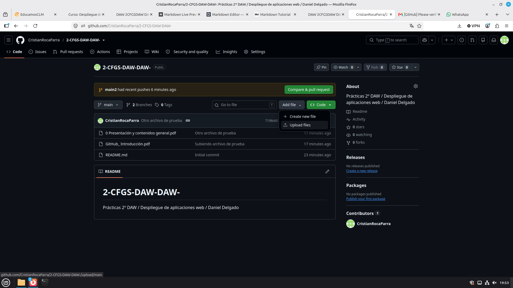
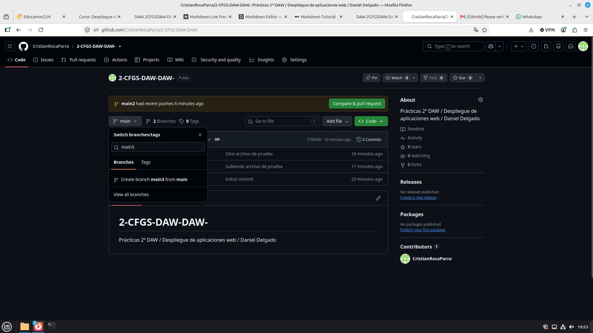
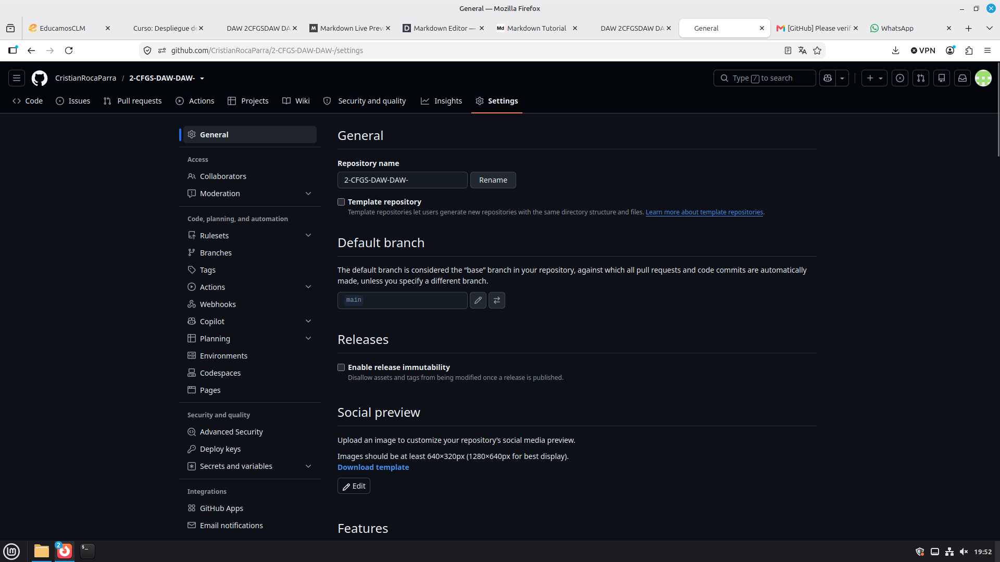

# Tutorial de Github hecho con Markdown
      
### Hecho por Cristian Roca Parra

    
## Introducción (Qué es GitHub y usos, así como qué se va a ver en este informe) 
	
El Github es un repositorio online donde puedes guardar y exponer tus propios projectos a otras personas o realizar copias de seguridad de los mismos para asegurarte no perder tu progreso.

## Pasos a seguir para conseguir las diferentes acciones: 

### Crear un repositorio  

### Agregar Archivos: 

### Pull request

### Crear Ramas

### Colaboradores

### Configuración

### Conclusiones 
Git hub es una herramienta muy útil para ir guardando los avances de tus proyectos en la nube al igual que para compartirlos con más personas.

### Bibliografía 
Cosecha pgopia
